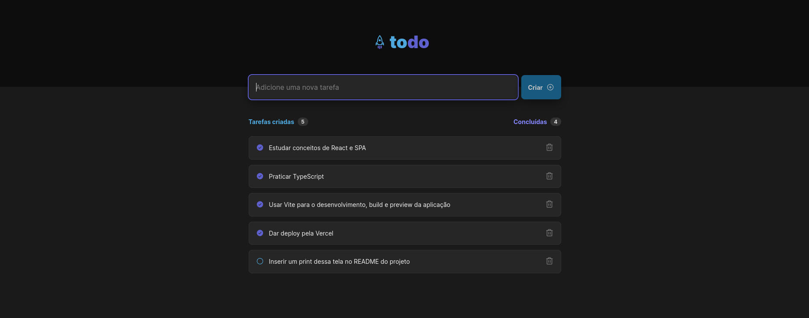
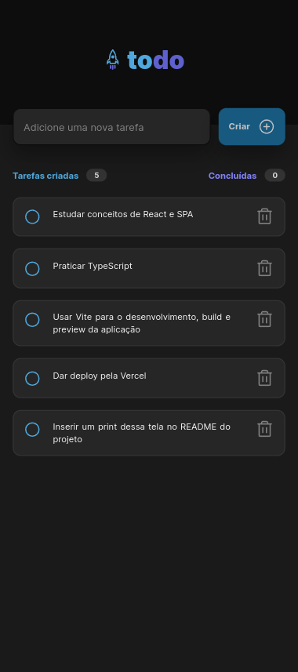

# One More ToDo List

ToDo List é uma página web para criação e controle de tarefas.

Acesse: ~link do deploy~

> Esse projeto é um dos desafios da trilha de React do Ignite. Ou seja, é fornecido somente um guia de estilos para o visual da aplicação e seu conceito. Todo o código, estrutura de pastas, dependências e técnicas de programação usadas são advindas de quem programa, de mim no caso.

## Previews

### Desktop:

### Mobile:

## Uso

É simples, entre na aplicação, registre algumas tarefas à fazer. Quando as terminar, volte na lista e marque como completo e a remova se quiser.

Você pode adicionar quantas tarefas quiser, elas serão persistidas no armazenamento local do navegador. A vantagem disso é que não é necessário nenhuma forma de autenticação ou autorização para o uso do app, mas ao mesmo tempo gera problemas quando trocamos de navegador ou dispositivo, pois as tarefas não irão persistir entre dispositivos.

Sendo essa sua única limitação, o app oferece uma interface limpa, responsiva (que se encaixa em dispositivos móveis e ambientes desktop) e funcionalidade simples para o dia a dia.

> A escolha das animações e diversos detalhes da interface foram escolhidos e adaptados por mim, para atender às minhas expectativas e visão do projeto.

## Ambiente de Desenvolvimento

- React;
- TypeScript.

## License

Distribuído sob licença MIT. Veja [`LICENSE`](./LICENSE) para mais informações.

## Meta

Meus links:

- [Gmail](mailto:dev.eddyyxxyy@gmail.com?)
- [Github](https://github.com/eddyyxxyy)
- [LinkedIn](https://www.linkedin.com/in/eeddyyxxyy/)
- [Youtube](https://www.youtube.com/@eddyxide)
